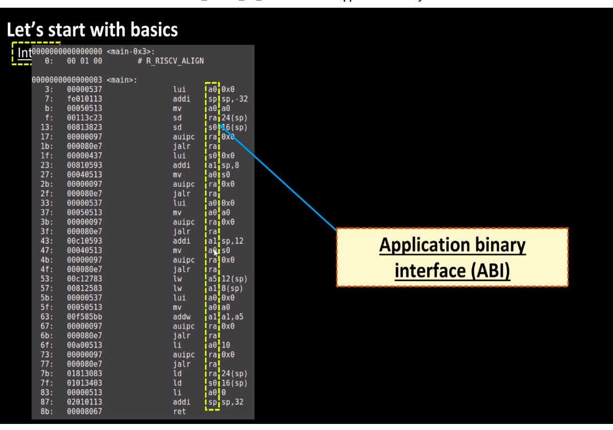
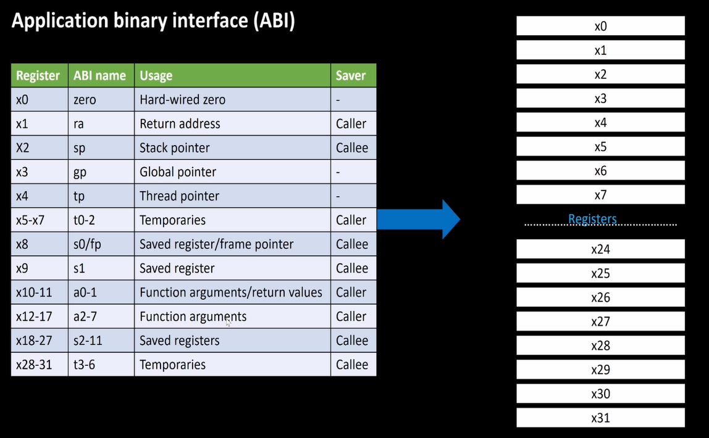
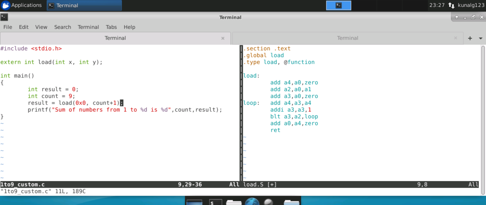
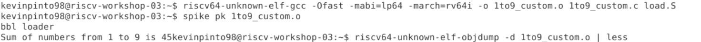
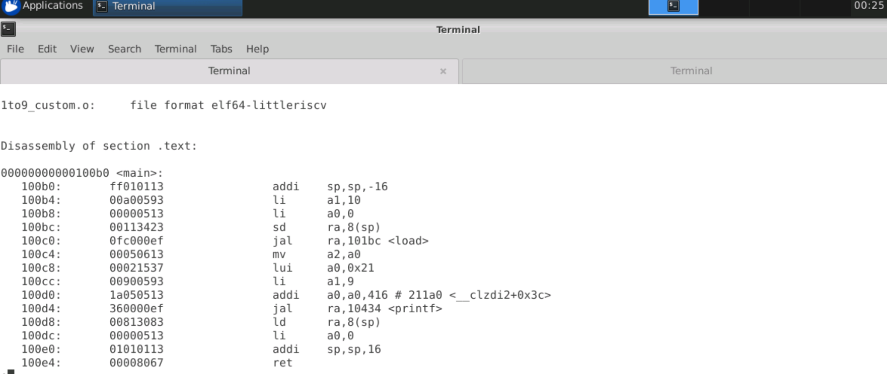
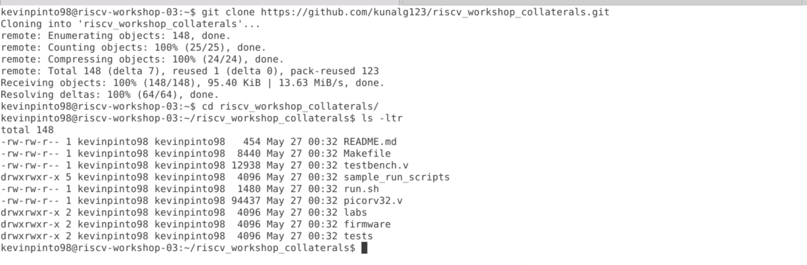
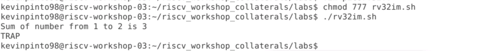
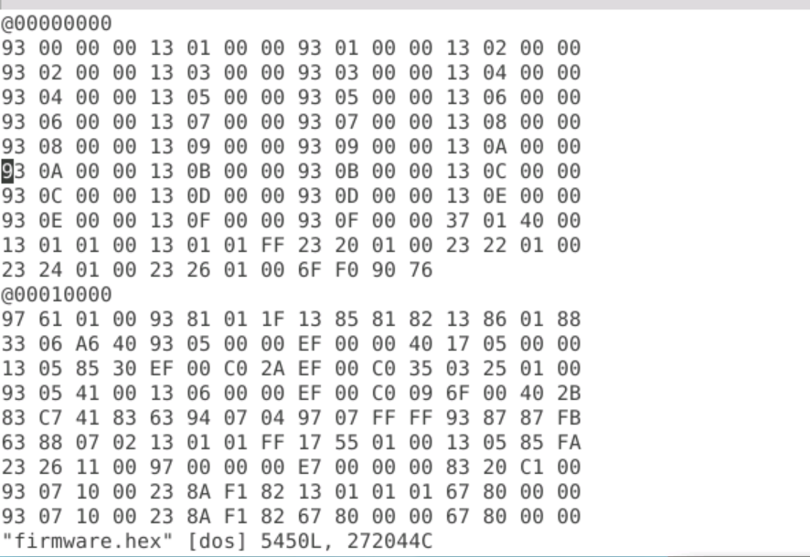
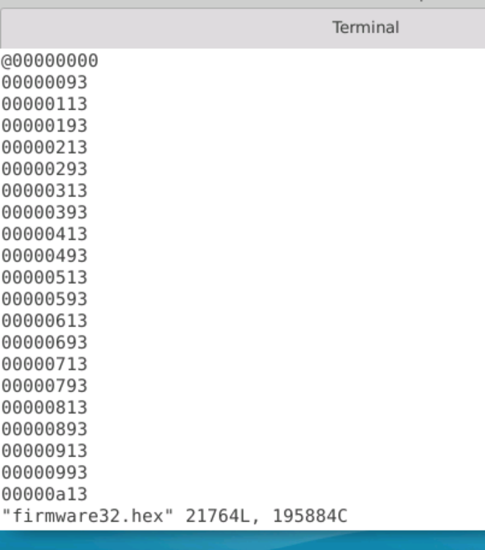

## Day 2: Introdution to ABI and Basic Verification Flow

* Application Binary Interface (ABI) describes a low-level interface between two applications or between an application and an operating system. An example of what the ABI interface looks like can be seen in the image below.

* ABI enables application programs to directly access the registers of the RISC-V architecture through system calls.

* The RISC-V architecture has 32 registers. Their ABI names as well as their usage is mentioned in the table below.

In Day 2, we have written a c program for caculating the sum of number from 1 to 9 as well as it's assembly equivalent. The respective programs are shown side-by-side in the image below:

Now let's discuss the commands used to compile and exceute the codes.

* Compiling the c code and assembly code together
> `riscv64-unknown-elf-gcc -Ofast -mabi=lp64 -march=rv64i -o <.o file> <.c file> <.S file>`

* Executing the code compiled in the step above
> `spike pk <.o file>`

* To disassemble the code
> `riscv64-unknown-elf-objdump -d <.o file> | less`

* To run a .sh file run the following commands:
> `chmod 777 <.sh file>`

> `./<.sh file>`

The outputs of the first three commands are shown in the images below:

Befor running the .sh script we will need to install a github repository. The steps involved in installing the github repo and running the .sh script are shown below:

The github repo cloned also contains hex format files. The files are depicted below:

