# RISC-V_MYTH_Workshop

For students of "Microprocessor for You in Thirty Hours" Workshop, offered by for VLSI System Design (VSD) and Redwood EDA, find here accompanying live info and links.

Refer to README at [stevehoover/RISC-V_MYTH_Workshop](https://github.com/stevehoover/RISC-V_MYTH_Workshop) for lab instructions.

Add your codes in the [calculator_solutions.tlv](calculator_solutions.tlv) and [risc-v_solutions.tlv](risc-v_solutions.tlv) files and **keep committing** to your repository after every lab.

## Day 3: Digital Logic with TL-Verilog and Makerchip
In Day 3, we have familiarized ourselves with the Makerchip IDE and the syntax of TL-Verilog. SOme features of TL-Verilog which make it unique are:

* Easy Pipelining
* Support for Timing Abstraction
* Familiar and Intuitive Syntax
* Enables faster development

In order to get comfortable with TL-Verilog we have implemnted several digitl ciruits some of which are shown here.

* Inverter

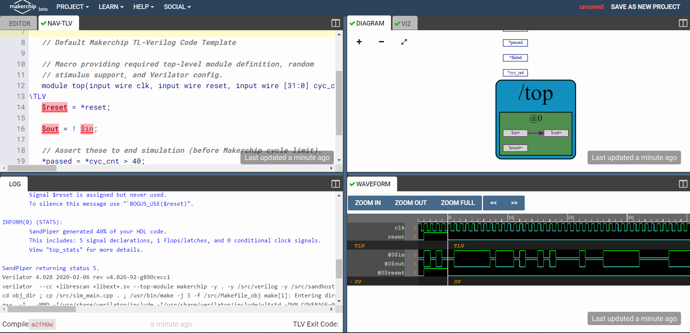

* AND Gate

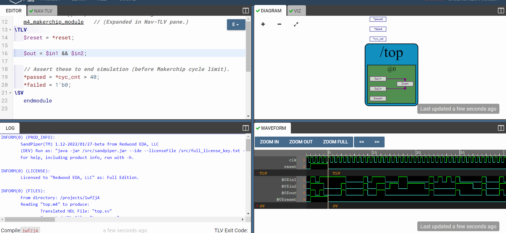

* OR Gate

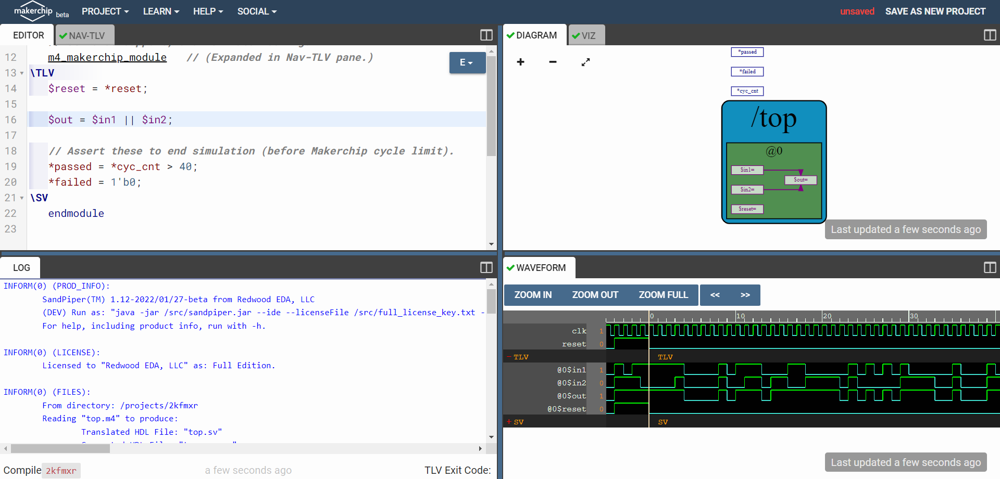

* XOR Gate

* Adder

* Mux

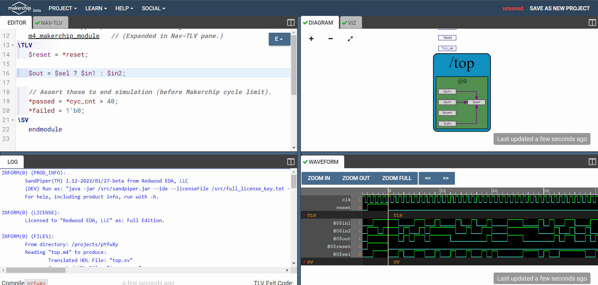

* Mux Vector

* Pythagoras Theorem

* Fibonacci Circuit Implementation

* Pipeline Lab

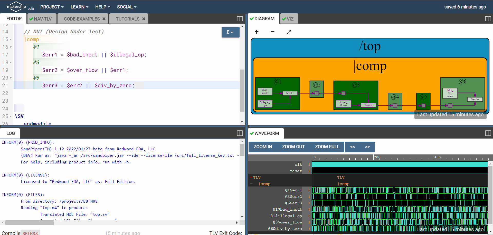

* Counter

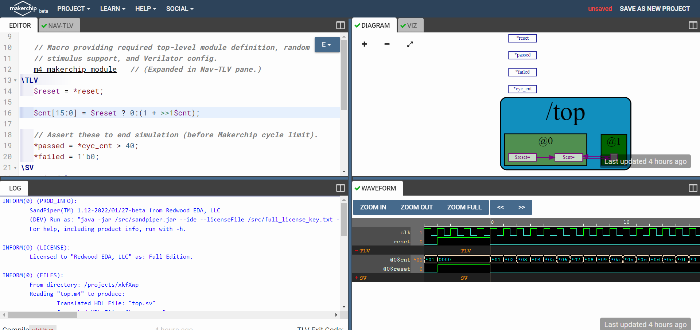

* Calculator

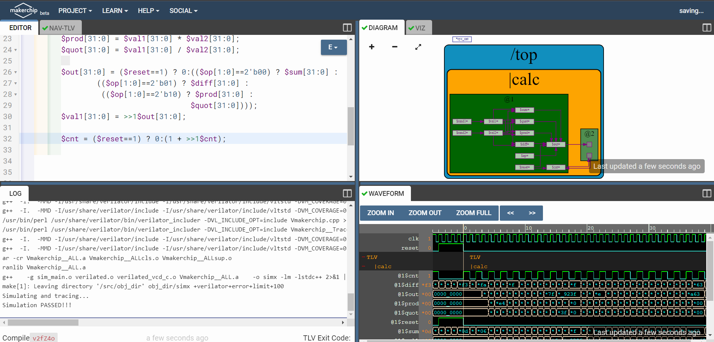

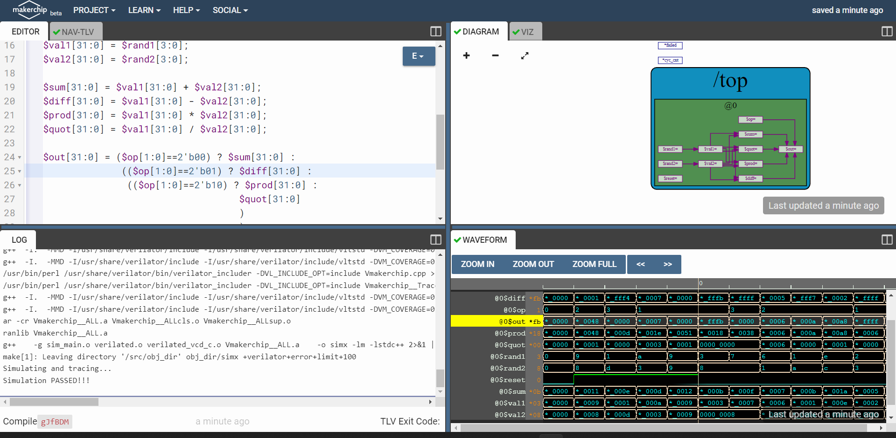

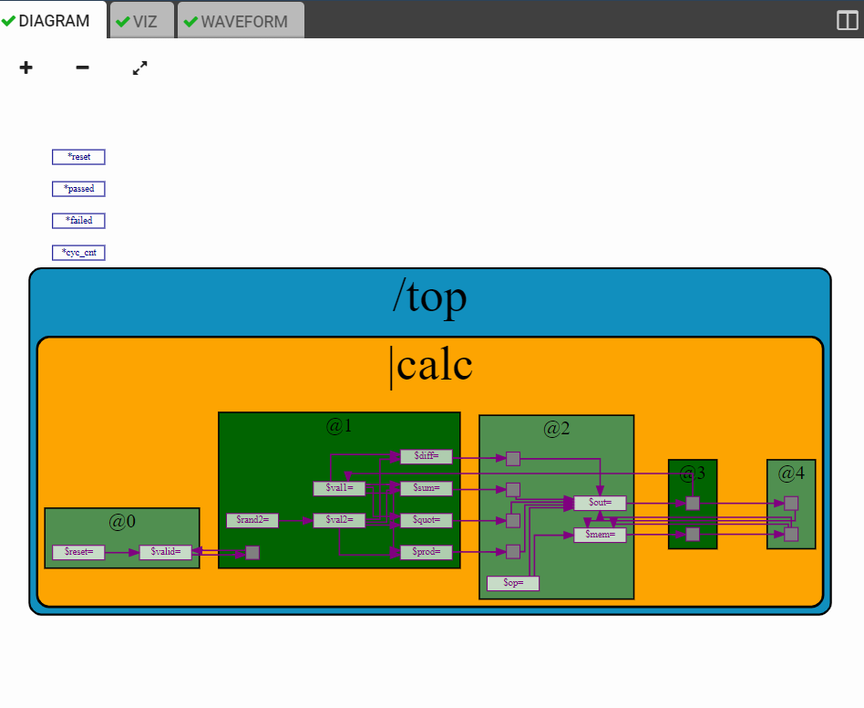

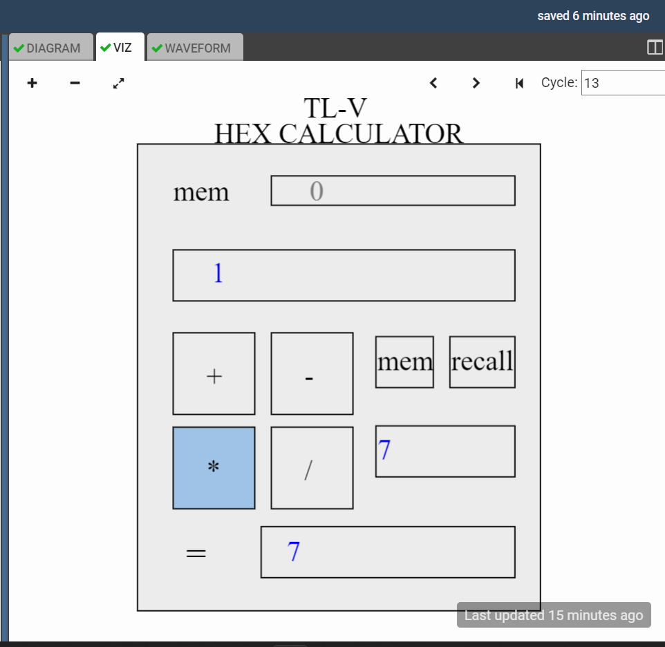

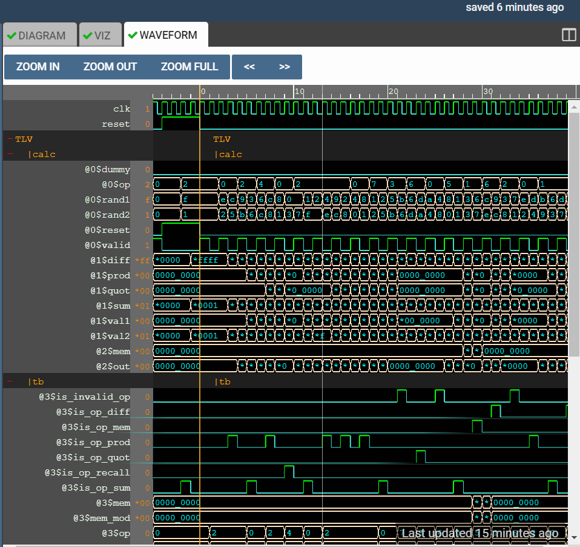

## Day 4: Basic RISC-V CPU Microarchitecture
In Day 4 we have implemented the basic microarchitecture for the RISC-V ISA. The figure below depicts the basic microarchitecture that we will be implementing today.

The code for the non-pipelined microarchitecture can be found in the file "non_pipelined_riscv_core.tlv" in the folder "Day3_5".

The images below depict the relevant figures obtained during the compilation and simulation of the code in the Makerchip IDE.

* Viz Window at Cycle 0

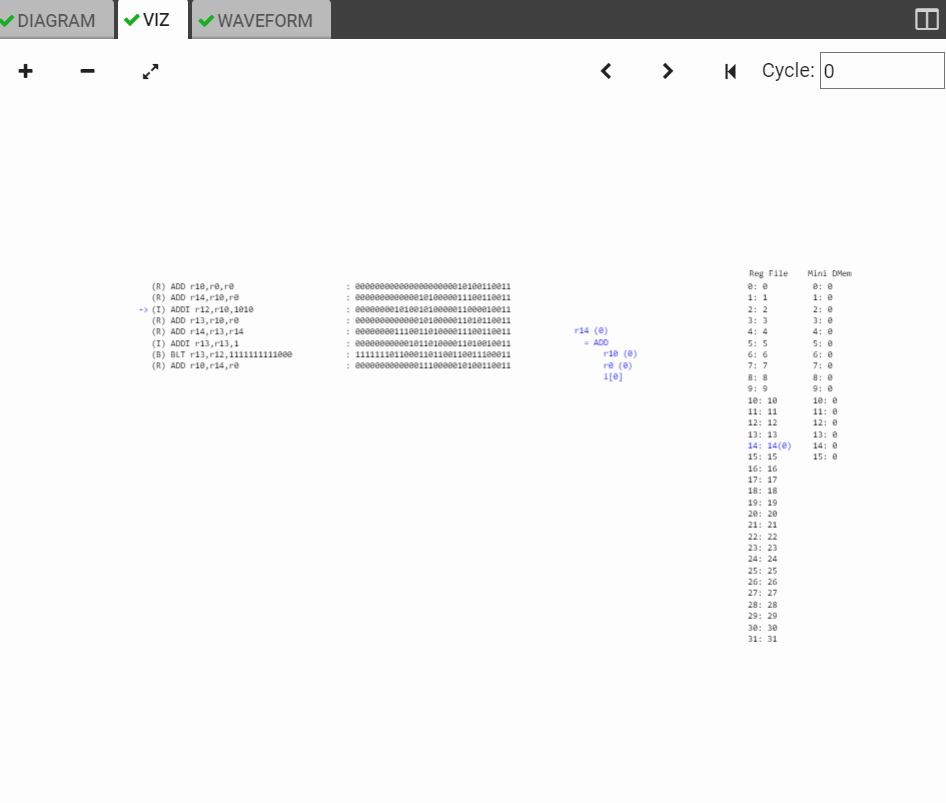

* Viz Window at the last cycle

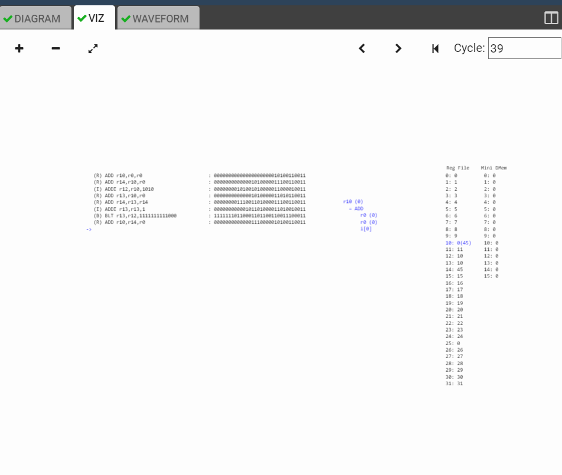

* Waveform Snapshots

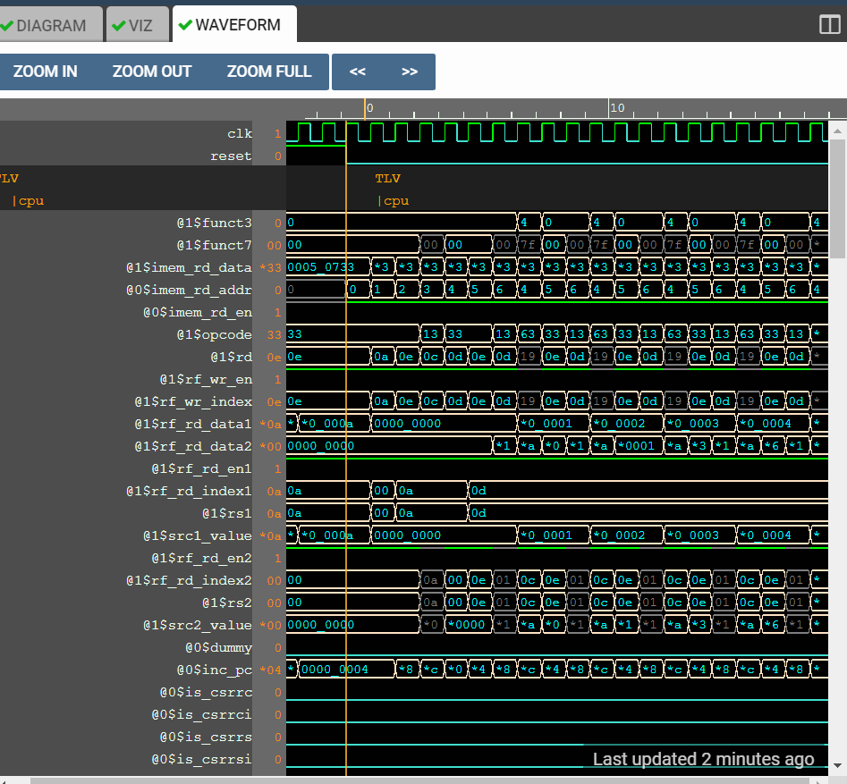

## Day 5: Complete Pipelined RISC-V CPU Microarchitecture
In Day 5 we have added pipeline stages for the microzrchitecture implemented in Day 4. The code for it can be found in the file "risc-v_solutions.tlv" in the folder "Day3_5".

The images below depict the relevant figures obtained during the compilation and simulation of the code in the Makerchip IDE.

* Viz Window at Cycle 0

* Viz Window at the last cycle

* Waveform Snapshots

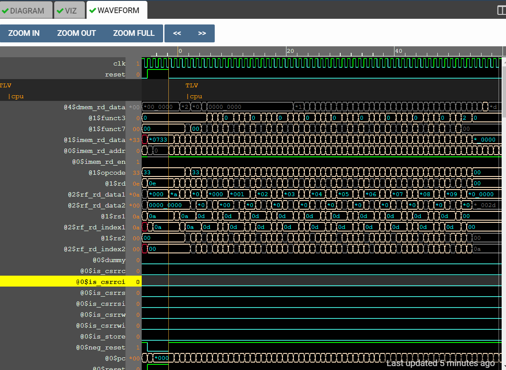

