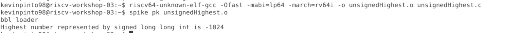

# RISC-V_MYTH_Workshop

This repository documents all the work that was done during the course of the [RISC-V MYTH Workshop](https://github.com/stevehoover/RISC-V_MYTH_Workshop).

## Workshop Schedule
* Day 1: Introduction to RISC-V ISA & GNU Compiler Toolchain
* Day 2: Introduction to ABI and Basic Verification Flow
* Day 3: Digital Logic with TL-Verilog and Makerchip
* Day 4: Basic RISC-V CPU Microarchitecture
* Day 5: Complete Pipelined RISC-V CPU Microarchitecture

## Day 1: Introduction to RISC-V ISA & GNU Compiler Toolchain
In Day 1, I have written a simple c-program to calculate the sum of numbers from 1 to a given integer (n). The program is as follows:

Kindly note that I have modified the program that was presented in the lab to take input n from the user.

* To compile the c code using the gcc compiler use
> `gcc <.c file>`

* To execute the compiled c code we use

> `./a.out`

* Command to compile C code using RISC-V compiler. The .o file is the executable we want to create.
> `% riscv64-unknown-elf-gcc -O1 -mabi=lp64 -march=rv64i -o <.o file> <.c file>`

* To see the assembly code of the C program we are trying to run
> `riscv64-unknown-elf-objdump -d <.o file we created during compilation>`

* To see less of the assembly code run
> `riscv64-unknown-elf-objdump -d <.o file we created during compilation> | less`

* A variation of `riscv64-unknown-elf-gcc` is given below. The .o file is the executable we want to create.
> `riscv64-unknown-elf-gcc -Ofast -mabi=lp64 -march=rv64i -o <.o file> <.c file>`

* To see output of c program after compilation using the riscv compiler use the following command
> `spike pk <.o file we created during compilation>`

* We can use spike an a debugger as well
> `spike -d pk <.o file we created during compilation>`

* To make the PC (Program Counter) run till a particular command we use
> `: until pc 0 [address_of_command]`

The images below depict the results obtained after running the commands described above:

In addition to the program summing up numbers from 1 to n we also looked at programs that determined the range of values that could be represented by signed and unsigned numbers.

Let's begin by looking at the case of Signed Numbers. The images below are of the code and the simulation results obtained during compilaton and execution of the said code.

In addition to Signed numbers we also implemented the code for the case of Unsigned numbers as well. The results are as shown below:

The images below are also for the case of Unsigned numbers but in here we are calculating the smallest number that can be represented using unsigned numbers.

**Note:** The reports for Days 2 to 5 are documented in the README.md files present in the folders of the respective days.

## Learning Outcomes
* Understanding the RISC-V ISA
* Using the RISC-V GNU Toolchain
* Syntax of TL-Verilog
* Implmentation of Combinational and Sequential Logic Circuits using TL-Verilog
* Building a pipelined RISC-V core

## Acknowledgements
- [Kunal Ghosh](https://github.com/kunalg123), Co-founder, VSD Corp. Pvt. Ltd.
- [Steve Hoover](https://github.com/stevehoover), Founder, Redwood EDA
- Shivam Potdar, TA
- Vineet Jain, TA
- Shivani Shah, TA