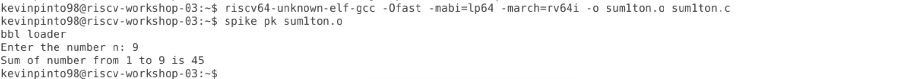
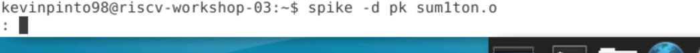
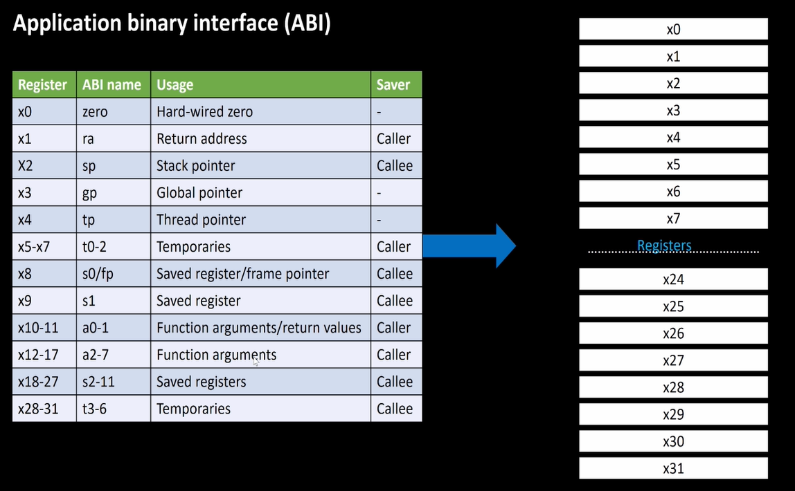
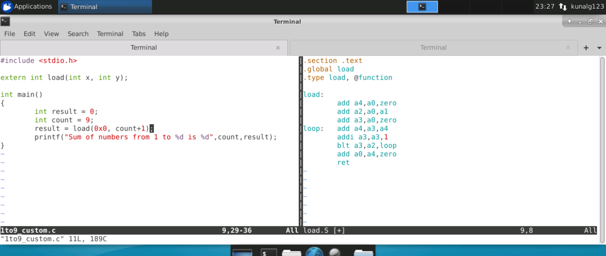
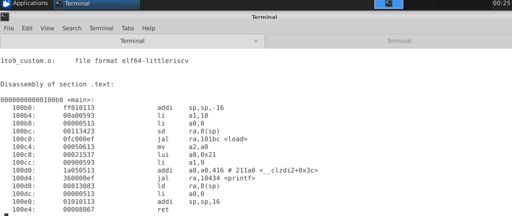
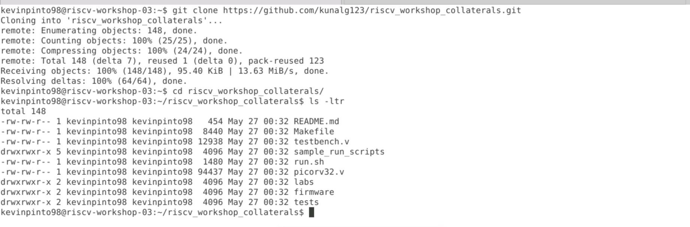

# RISC-V_MYTH_Workshop

This repository documents all the work that was done during the course of the [RISC-V MYTH Workshop](https://github.com/stevehoover/RISC-V_MYTH_Workshop).

## Workshop Schedule
* Day 1: Introduction to RISC-V ISA & GNU Compiler Toolchain
* Day 2: Introduction to ABI and Basic Verification Flow
* Day 3: Digital Logic with TL-Verilog and Makerchip
* Day 4: Basic RISC-V CPU Microarchitecture
* Day 5: Complete Pipelined RISC-V CPU Microarchitecture

## Day 1: Introduction to RISC-V ISA & GNU Compiler Toolchain
In Day 1, I have written a simple c-program to calculate the sum of numbers from 1 to a given integer (n). The program is as follows:

Kindly note that I have modified the program that was presented in the lab to take input n from the user.

* To compile the c code using the gcc compiler use
> `gcc <.c file>`

* To execute the compiled c code we use

> `./a.out`

* Command to compile C code using RISC-V compiler. The .o file is the executable we want to create.
> `% riscv64-unknown-elf-gcc -O1 -mabi=lp64 -march=rv64i -o <.o file> <.c file>`

* To see the assembly code of the C program we are trying to run
> `riscv64-unknown-elf-objdump -d <.o file we created during compilation>`

* To see less of the assembly code run
> `riscv64-unknown-elf-objdump -d <.o file we created during compilation> | less`

* A variation of `riscv64-unknown-elf-gcc` is given below. The .o file is the executable we want to create.
> `riscv64-unknown-elf-gcc -Ofast -mabi=lp64 -march=rv64i -o <.o file> <.c file>`

* To see output of c program after compilation using the riscv compiler use the following command
> `spike pk <.o file we created during compilation>`

* We can use spike an a debugger as well
> `spike -d pk <.o file we created during compilation>`

* To make the PC (Program Counter) run till a particular command we use
> `: until pc 0 [address_of_command]`

The images below depict the results obtained after running the commands described above:

In addition to the program summing up numbers from 1 to n we also looked at programs that determined the range of values that could be represented by signed and unsigned numbers.

Let's begin by looking at the case of Signed Numbers. The images below are of the code and the simulation results obtained during compilaton and execution of the said code.

In addition to Signed numbers we also implemented the code for the case of Unsigned numbers as well. The results are as shown below:

The images below are also for the case of Unsigned numbers but in here we are calculating the smallest number that can be represented using unsigned numbers.

## Day 2: Introdution to ABI and Basic Verification Flow

* Application Binary Interface (ABI) describes a low-level interface between two applications or between an application and an operating system. An example of what the ABI interface looks like can be seen in the image below.

* ABI enables application programs to directly access the registers of the RISC-V architecture through system calls.

* The RISC-V architecture has 32 registers. Their ABI names as well as their usage is mentioned in the table below.

In Day 2, we have written a c program for caculating the sum of number from 1 to 9 as well as it's assembly equivalent. The respective programs are shown side-by-side in the image below:

Now let's discuss the commands used to compile and exceute the codes.

* Compiling the c code and assembly code together
> `riscv64-unknown-elf-gcc -Ofast -mabi=lp64 -march=rv64i -o <.o file> <.c file> <.S file>`

* Executing the code compiled in the step above
> `spike pk <.o file>`

* To disassemble the code
> `riscv64-unknown-elf-objdump -d <.o file> | less`

* To run a .sh file run the following commands:
> `chmod 777 <.sh file>`

> `./<.sh file>`

The outputs of the first three commands are shown in the images below:

Befor running the .sh script we will need to install a github repository. The steps involved in installing the github repo and running the .sh script are shown below:

The github repo cloned also contains hex format files. The files are depicted below:

## Day 3: Digital Logic with TL-Verilog and Makerchip
In Day 3, we have familiarized ourselves with the Makerchip IDE and the syntax of TL-Verilog. Some features of TL-Verilog which make it unique are:

* Easy Pipelining
* Support for Timing Abstraction
* Familiar and Intuitive Syntax
* Enables faster development

In order to get comfortable with TL-Verilog we have implemented several digital ciruits some of which are shown here.

* Inverter

* AND Gate

* OR Gate

* XOR Gate

* Adder

* Mux

* Mux Vector

* Pythagoras Theorem

* Fibonacci Circuit Implementation

* Pipeline Lab

* Counter

* Calculator

## Day 4: Basic RISC-V CPU Microarchitecture
In Day 4 we have implemented the basic microarchitecture for the RISC-V ISA. The figure below depicts the basic microarchitecture that we will be implementing today.

The code for the non-pipelined microarchitecture can be found in the file "non_pipelined_riscv_core.tlv" in the folder "Day3_5".

The images below depict the relevant figures obtained during the compilation and simulation of the code in the Makerchip IDE.

* Viz Window at Cycle 0

* Viz Window at the last cycle

* Waveform Snapshots

## Day 5: Complete Pipelined RISC-V CPU Microarchitecture
In Day 5 we have added pipeline stages for the microzrchitecture implemented in Day 4. The code for it can be found in the file "risc-v_solutions.tlv" in the folder "Day3_5".

The images below depict the relevant figures obtained during the compilation and simulation of the code in the Makerchip IDE.

* Viz Window at Cycle 0

* Viz Window at the last cycle

* Waveform Snapshots

**Note:** The reports for Days 2 to 5 are also documented in the README.md files present in the folders of the respective days.

## Learning Outcomes
* Understanding the RISC-V ISA
* Using the RISC-V GNU Toolchain
* Syntax of TL-Verilog
* Implmentation of Combinational and Sequential Logic Circuits using TL-Verilog
* Building a pipelined RISC-V core

## Acknowledgements
- [Kunal Ghosh](https://github.com/kunalg123), Co-founder, VSD Corp. Pvt. Ltd.
- [Steve Hoover](https://github.com/stevehoover), Founder, Redwood EDA
- Shivam Potdar, TA
- Vineet Jain, TA
- Shivani Shah, TA